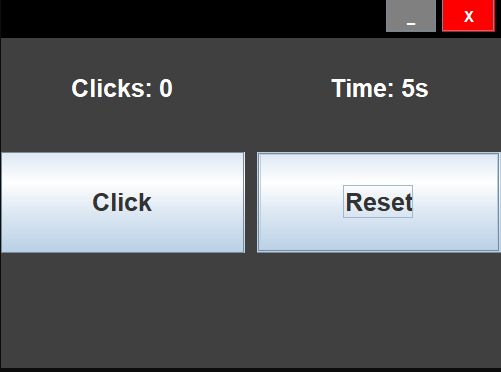
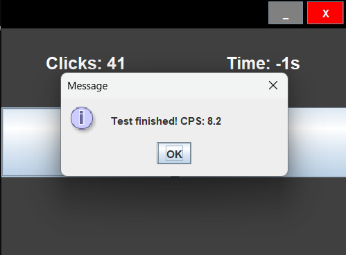

# CPS-Tester

This application is my other big project besides [HelloWinter](https://github.com/konraaadcz/HelloWinter). To run it, run the `start.bat` file 

You will need the latest version of Java to use it, so if you don't have it yet, [install](https://www.oracle.com/java/technologies/downloads/) it!

# Spoilers

----------------------------------------------------------

## License

The project is licensed under [Apache-2.0](LICENSE)

## Credits

I used [Oracle's Java Swing Documentation](https://docs.oracle.com/javase/8/docs/api/javax/swing/package-summary.html) several times during development

